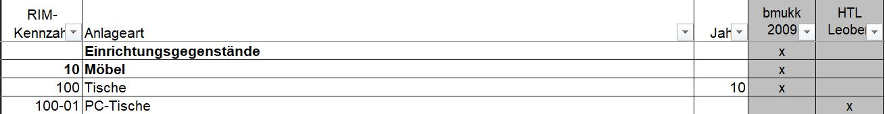
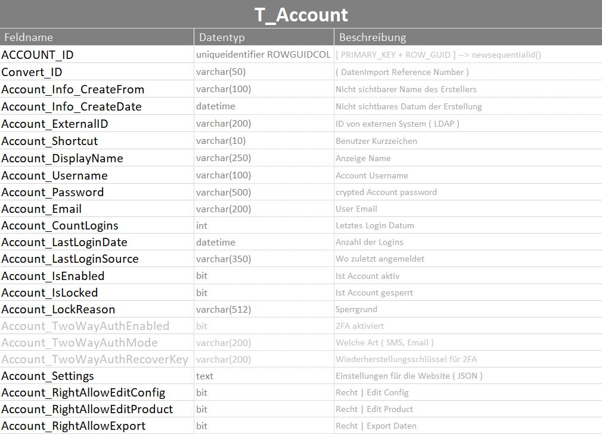
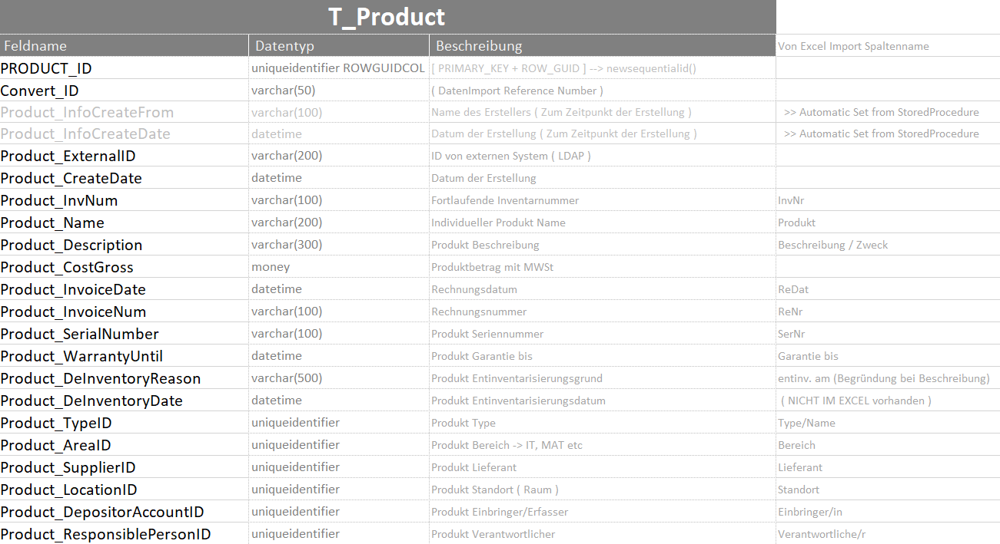
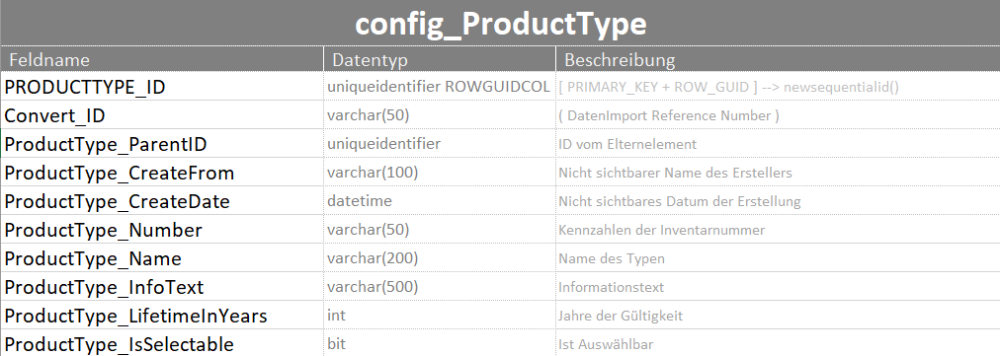
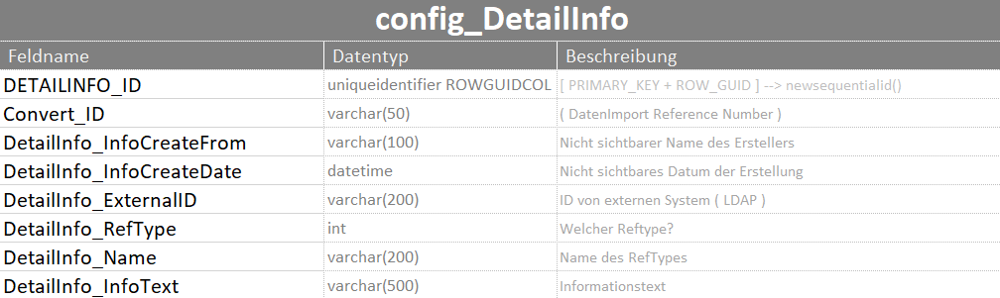
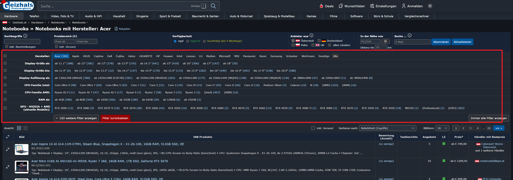
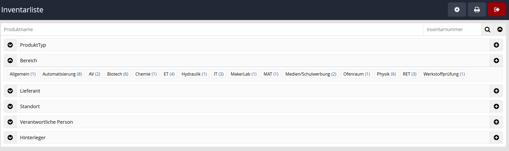
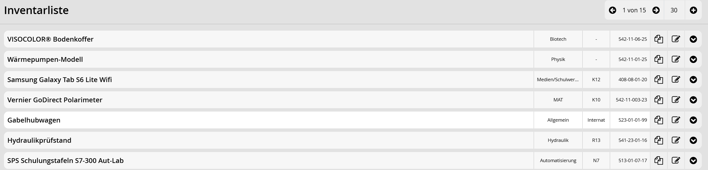
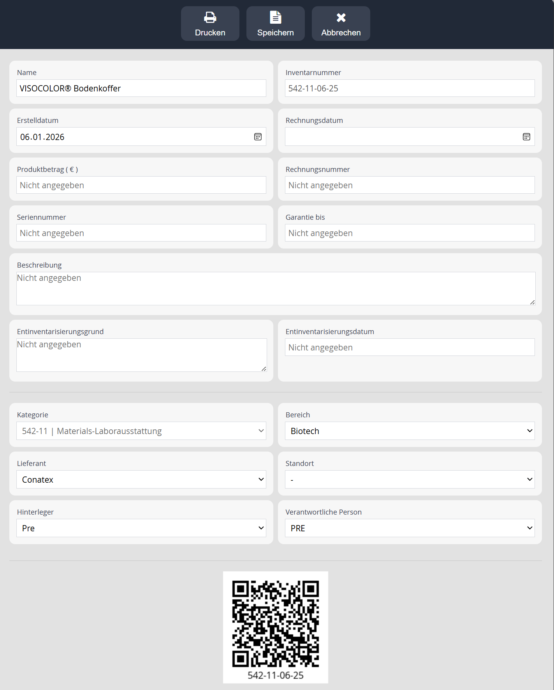

# Teilaufgabe André Karner

## Verwendete Technologien

Für die Entwicklung der webbasierten Inventarisierungslösung kamen verschiedene, aufeinander abgestimmte Technologien zum Einsatz.  
Diese bilden das Fundament für eine moderne, stabile und benutzerfreundliche Anwendung, die sowohl auf Desktop- als auch auf mobilen Geräten zuverlässig funktioniert.  

Die Auswahl der Technologien erfolgte auf Basis folgender Kriterien:  

- **Kompatibilität und Standardisierung:** Alle eingesetzten Technologien entsprechen gängigen Webstandards und werden von aktuellen Browsern sowie Betriebssystemen unterstützt.  
- **Trennung von Struktur, Darstellung und Logik:** Durch die konsequente Trennung von HTML, CSS, JavaScript und serverseitiger Logik wird eine klare und wartbare Softwarearchitektur gewährleistet.  
- **Effizienz und Benutzerfreundlichkeit:** Die Kombination aus clientseitigen und serverseitigen Technologien ermöglicht schnelle Ladezeiten, interaktive Oberflächen und eine intuitive Bedienung.  
- **Zukunftssicherheit:** Die eingesetzten Technologien sind weit verbreitet, gut dokumentiert und bieten eine langfristige Perspektive für Wartung und Erweiterung.  

Im Folgenden werden die einzelnen Technologien, ihre Einsatzgebiete, Entscheidungsgründe und Vorteile im Detail erläutert. Dies umfasst sowohl die **Frontend-Technologien** (HTML, CSS, JavaScript, AJAX) zur Gestaltung der Benutzeroberfläche als auch die **Backend-Technologien** (PHP, SQL Server, IIS) für Datenverarbeitung, Speicherung und Zugriffskontrolle. Abschließend wird das eingesetzte Framework vorgestellt, das die Entwicklung strukturierter und effizienter gestaltet.

### HyperText Markup Language (HTML)

#### Erläuterung  
HTML (HyperText Markup Language) stellt die strukturelle Grundlage der webbasierten Inventarisierungslösung dar. Es wird zur semantischen Beschreibung und klaren Gliederung sämtlicher Inhalte der Benutzeroberfläche eingesetzt. Dazu zählen unter anderem Eingabeformulare, Tabellen zur Darstellung von Inventardaten, Navigationsbereiche sowie verschiedene Bedienelemente. Durch die Verwendung semantischer HTML-Elemente wird sowohl die Lesbarkeit des Codes als auch die Zugänglichkeit der Anwendung verbessert.[@mdn_html]

#### Entscheidungsgrundlage  
HTML ist der international anerkannte Standard zur Strukturierung von Webinhalten und wird von allen gängigen Webbrowsern vollständig unterstützt. Aufgrund seiner Stabilität, langfristigen Zukunftssicherheit sowie der nahtlosen Kombinierbarkeit mit CSS und JavaScript eignet sich HTML besonders gut für die Entwicklung einer webbasierten Anwendung im schulischen Umfeld.[@mdn_html]

#### Vorteile  
- Plattform- und browserunabhängig  
- Klare und semantische Strukturierung von Inhalten  
- Hohe Wartbarkeit und Erweiterbarkeit des Codes  
- Standardisierte und bewährte Webtechnologie[@mdn_html]


### Cascading Style Sheets (CSS)

#### Erläuterung  
Cascading Style Sheets (CSS) werden zur visuellen Gestaltung der Webanwendung verwendet. Mithilfe von CSS werden Layout, Farbgestaltung, Schriftarten, Abstände sowie responsive Anpassungen definiert. Dadurch entsteht ein übersichtliches, modernes und benutzerfreundliches Erscheinungsbild der Inventarisierungsoberfläche, das die Bedienbarkeit wesentlich unterstützt.[@mdn_css]

#### Entscheidungsgrundlage  
Durch die konsequente Trennung von Struktur (HTML) und Darstellung (CSS) wird eine saubere und übersichtliche Softwarearchitektur realisiert. CSS ist ein etablierter Webstandard und bietet umfangreiche Möglichkeiten zur Gestaltung responsiver Benutzeroberflächen, die auf unterschiedlichen Endgeräten korrekt dargestellt werden.[@mdn_css]

#### Vorteile  
- Klare Trennung von Inhalt und Darstellung  
- Einheitliches Design über alle Seiten hinweg  
- Unterstützung für responsive und adaptive Layouts  
- Verbesserung der Benutzerfreundlichkeit und Übersichtlichkeit[@mdn_css]  


### Hypertext Preprocessor (PHP)

#### Erläuterung  
PHP ist eine serverseitige Skriptsprache und bildet gemeinsam mit der Datenbank das Backend der Inventarisierungslösung. Sie wird zur Verarbeitung von Benutzereingaben, zur Umsetzung der Geschäftslogik sowie zur Kommunikation mit der Datenbank eingesetzt. Darüber hinaus kommt PHP für serverseitige Prozesse wie die Generierung von QR-Codes und die Zugriffskontrolle zum Einsatz.[@php_manual]

#### Entscheidungsgrundlage  
PHP ist besonders für webbasierte Anwendungen geeignet und wird seit vielen Jahren erfolgreich eingesetzt. Durch die breite Verfügbarkeit, die umfangreiche Dokumentation sowie die einfache Wartbarkeit ist PHP eine zuverlässige Wahl für die Umsetzung der vorliegenden Aufgabenstellung.[@php_manual]

#### Vorteile  
- Serverseitige Verarbeitung sensibler Daten  
- Gute Integration mit relationalen Datenbanksystemen  
- Weit verbreitet und umfangreich dokumentiert  
- Geeignet für wartungsfreundliche und skalierbare Webanwendungen[@php_manual]


### JavaScript (JS)

#### Erläuterung  
JavaScript wird clientseitig verwendet, um die Benutzeroberfläche interaktiv zu gestalten. Dazu zählen dynamische Formularvalidierungen, Benutzerinteraktionen sowie die Steuerung von Abläufen, die ohne vollständige Seitenneuladungen auskommen. Dadurch wird die Reaktionsfähigkeit der Anwendung deutlich erhöht.[@mdn_javascript]

#### Entscheidungsgrundlage  
JavaScript ist die Standardsprache für clientseitige Webentwicklung und wird von allen modernen Browsern unterstützt. Der gezielte Einsatz von JavaScript ermöglicht eine spürbare Verbesserung der Benutzererfahrung und trägt zu einer intuitiven Bedienung der Anwendung bei.[@mdn_javascript]

#### Vorteile  
- Hohe Interaktivität der Benutzeroberfläche  
- Verbesserte Benutzererfahrung und Reaktionsgeschwindigkeit  
- Direkte und nahtlose Integration mit HTML und CSS[@mdn_javascript]  


### Asynchronous JavaScript and XML (AJAX)

#### Erläuterung  
AJAX ermöglicht eine asynchrone Kommunikation zwischen Client und Server. Dadurch können Daten, wie Inventareinträge, Suchergebnisse oder Filteroptionen, im Hintergrund geladen oder aktualisiert werden, ohne dass die gesamte Webseite neu geladen werden muss.[@mdn_ajax]

#### Entscheidungsgrundlage  
Für eine moderne Inventarisierungslösung ist eine schnelle und reaktionsfähige Benutzeroberfläche essenziell. Der Einsatz von AJAX unterstützt dieses Ziel maßgeblich und trägt zur Effizienz sowie zur positiven Nutzererfahrung der Anwendung bei.[@mdn_ajax]

#### Vorteile  
- Keine vollständigen Seitenneuladungen notwendig  
- Schnellere Reaktionszeiten der Anwendung  
- Reduzierte Server- und Netzwerkbelastung  
- Deutlich erhöhte Benutzerfreundlichkeit[@mdn_ajax]  


### SQL Server Management Studio (SSMS)

#### Erläuterung  
Das SQL Server Management Studio (SSMS) dient zur Verwaltung und Pflege der relationalen Datenbank der Anwendung. Es wird zur Erstellung und Anpassung von Tabellen, zur Ausführung von Abfragen sowie zur Verwaltung und Analyse der gespeicherten Inventardaten eingesetzt.[@microsoft_ssms]

#### Entscheidungsgrundlage  
SSMS ist ein etabliertes Administrationswerkzeug für Microsoft SQL Server. Die Nutzung ermöglicht eine strukturierte, zuverlässige und nachvollziehbare Verwaltung der Datenbank und unterstützt die Entwicklung sowie Wartung der Anwendung.[@microsoft_ssms]

#### Vorteile  
- Intuitive grafische Benutzeroberfläche  
- Leistungsfähige Verwaltungs- und Abfragefunktionen  
- Hohe Stabilität und Zuverlässigkeit  
- Gute Integration in Microsoft-Systeme[@microsoft_ssms]


### Internet Information Services (IIS)

#### Erläuterung  
Internet Information Services (IIS) wird als Webserver für den Betrieb der Inventarisierungsanwendung eingesetzt. Der Webserver stellt sowohl die PHP-Anwendung als auch statische Inhalte wie HTML-, CSS- und JavaScript-Dateien bereit und ermöglicht den Zugriff über das interne Netzwerk.[@microsoft_iis]

#### Entscheidungsgrundlage  
IIS ist Bestandteil von Windows-Server-Systemen und bietet eine stabile sowie sichere Plattform für den Betrieb von Webanwendungen. Die Kombination aus IIS, PHP und Microsoft SQL Server ermöglicht einen zuverlässigen und wartungsfreundlichen Betrieb der Inventarisierungslösung.[@microsoft_iis]

#### Vorteile  
- Hohe Stabilität und Sicherheit  
- Zentrale Verwaltung der Webanwendung  
- Gute Integration mit Windows-Diensten  
- Geeignet für den produktiven Einsatz im Schulumfeld[@microsoft_iis]


### Benutzte Frameworks

Für die Umsetzung der Anwendung in PHP und JavaScript wurde ein firmeneigenes Framework der **BasicSystems GmbH** verwendet. Dieses Framework ermöglicht eine effiziente und strukturierte Kommunikation mit der Datenbank und vereinfacht gleichzeitig die Implementierung sowie Verwaltung von AJAX-Abläufen. Dadurch werden Entwicklungsprozesse übersichtlicher und besser nachvollziehbar.

Aus rechtlichen Gründen können keine detaillierten technischen Informationen zu diesem Framework bereitgestellt werden. Die HTL Leoben erhält ausschließlich das Nutzungs- und Bearbeitungsrecht der Anwendung. Eine Weitergabe oder Veröffentlichung des Quellcodes an Dritte ist ausdrücklich untersagt.

---

## Datenauswertung & Datenbankerstellung  

### Datenquelle  
Die Grundlage für die Datenbankstruktur bildet eine von der Schule bereitgestellte Excel-Liste mit dem Namen  
[`HTLGesamtinventar_Monitorbeispiel.xlsx`](doc/HTLGesamtinventar_Monitorbeispiel.xlsx).  
Diese Datei diente als initiale Datenbasis und lieferte einen ersten Überblick über den bestehenden Inventarbestand sowie über die verwendeten Datenfelder.

Im weiteren Verlauf der Analyse wurde diese Basis aufgrund einer erweiterten und aktuelleren Excel-Liste  
[`HTLGesamtinventar_Auszug20251120.xlsx`](doc/HTLGesamtinventar_Auszug20251120.xlsx) ergänzt.  
Diese zweite Datei enthielt zusätzliche Datensätze sowie weitere Informationen, die für die vollständige Abbildung des Inventars notwendig waren.

Der geplante Tabellenaufbau aller Datenbanktabellen ist zusätzlich in der Excel-Datei  
[`da_inventory_TableSchema.xlsx`](doc/da_inventory_TableSchema.xlsx) dokumentiert.  
Diese Datei dient als verbindliche Referenz für die Struktur, Benennung und Datentypen der einzelnen Felder.


### Erkenntnisse  
Aus der Analyse der Excel-Listen, einem persönlichen Gespräch mit dem Auftraggeber sowie aus der praktischen Entwicklung der Anwendung ergaben sich mehrere wesentliche Erkenntnisse, die maßgeblich Einfluss auf das Datenbankdesign und die Applikationslogik hatten.


### Inventarnummer – Erkenntnisse  
Die Inventarnummer setzt sich aus **vier numerischen Bestandteilen** zusammen, welche jeweils eine bestimmte Bedeutung haben:

- **Erste Zahl:**  
  Kennzahl aus der Anlagenkennzahlenübersicht, zum Beispiel **408** für Datenverarbeitungsanlagen.  

- **Zweite Zahl:**  
  Unterkategorie, die gemäß einer HTL-internen Liste aufsteigend nummeriert ist, zum Beispiel **09** für Monitore.  

- **Dritte Zahl:**  
  Fortlaufende Nummer des im jeweiligen Kalenderjahr angeschafften Geräts, zum Beispiel **10** für den zehnten Monitor im entsprechenden Jahr.  

- **Vierte Zahl:**  
  Kalenderjahr der Anschaffung, zum Beispiel **2025**.  

Eine vollständige Beispiel-Inventarnummer ergibt somit folgendes Format:  
**408-09-10-25**

Diese Struktur ermöglicht eine eindeutige Identifikation jedes Inventargegenstandes und liefert gleichzeitig wichtige Informationen über Kategorie, Typ und Anschaffungsjahr.


### Anlagenkennzahl – Erkenntnisse  
Zusätzlich zeigte die Analyse der Kennzahlenliste  
[`AnlagenkennzahlübersichtRIMGesamt_09_kompakt.xlsx`](doc/AnlagenkennzahlübersichtRIMGesamt_09_kompakt.xlsx),  
dass eine eigene Tabelle für Anlagenkennzahlen notwendig ist.

Dabei ist besonders zu beachten, dass die Kennzahlen **hierarchisch aufgebaut** sind.  
Es existieren sogenannte **Überkategorien (Parent)**, aus denen mehrere **Unterkategorien (Child)** hervorgehen.

Zur besseren Veranschaulichung ist nachfolgend ein Ausschnitt aus der Excel-Liste dargestellt:




### Erklärung des Anlagenkennzahlbeispiels  
In diesem Beispiel stellt **Tische (100)** die übergeordnete Kategorie (Parent) dar, während **PC-Tische (100-01)** eine untergeordnete Kategorie (Child) ist.  

Um diese Hierarchie korrekt in der Datenbank abzubilden, wurde folgende grundlegende Struktur umgesetzt:

| Feldname               | Datentyp                   | Beschreibung                    |
|------------------------|----------------------------|--------------------------------|
| PRODUCTTYPE_ID         | uniqueidentifier ROWGUIDCOL | [PRIMARY_KEY + ROW_GUID]       |
| ProductType_ParentID   | uniqueidentifier           | ID des Elternelements          |

Die Tabelle enthält selbstverständlich weitere Felder, welche an dieser Stelle jedoch bewusst **nicht** detailliert erläutert werden, da sie für das grundlegende Verständnis der Hierarchie nicht erforderlich sind.


### Erklärung der Felder  

| Feldname               | Erklärung                    |
|------------------------|------------------------------|
| PRODUCTTYPE_ID         | ID des Child-Objekts         |
| ProductType_ParentID   | ID des Elternelements        |


### Hinfällige Felder  
Im Zuge der Umstrukturierung und Normalisierung der Datenbank ergab sich, dass einige Spalten aus der ursprünglichen Excel-Liste nicht mehr benötigt werden. Diese Felder sind im neuen System hinfällig:

- **Stk**  
- **Gesamt**  

Diese Informationen lassen sich entweder ableiten oder sind für die digitale Inventarisierung nicht mehr relevant.


### Datenfelder  
Weiters wurde festgestellt, dass bestimmte Datenfelder in der Anwendung nicht als Freitextfelder, sondern als **Dropdown-Menüs** umgesetzt werden sollen, um eine einheitliche Dateneingabe sicherzustellen.

Dies betrifft folgende Felder:

| Daten               |
|--------------------|
| Bereich             |
| Lieferant           |
| Standort            |
| Einbringer/in       |
| Verantwortliche/r   |


### Auswahl der Datenbank  
Als Datenbanksystem wurde **SQL Server Management Studio 2019 (SSMS)** gewählt.

Die Entscheidung fiel unter anderem aufgrund der privaten Vorerfahrung mit SQL Server Management Studio, wodurch das notwendige Fachwissen bereits vorhanden war.  
Zusätzlich bietet **SSMS** zahlreiche leistungsstarke Funktionen, darunter:

- Views  
- Funktionen  
- Stored Procedures  

Insbesondere **Stored Procedures** stellen einen zentralen Bestandteil einer sicheren Anwendung dar, da sie unter anderem einen wirksamen **Schutz vor SQL-Injection-Angriffen** ermöglichen.


### Ticketsystem-Anbindung  
Aus dem Gespräch mit dem Auftraggeber ergab sich zusätzlich die Anforderung, das neue Inventarisierungssystem zukünftig mit einem bereits bestehenden Ticketsystem zu verbinden.  

Die derzeitige Lösung sieht vor, eine zusätzliche Spalte in der Datenbank zu integrieren, welche die jeweilige ID aus dem Ticketsystem speichert.  
Diese Erweiterung dient ausschließlich der Vorbereitung einer späteren Anbindung und ist **nicht Bestandteil dieser Diplomarbeit**.

### LDAP-Anbindung  
Ebenso wurde der Wunsch geäußert, das System künftig an ein LDAP-System anzubinden.  

Auch hierfür ist vorgesehen, eine zusätzliche Spalte zur Speicherung der LDAP-ID zu integrieren.  
Die tatsächliche Umsetzung einer LDAP-Anbindung ist jedoch **nicht Teil der Diplomarbeit**, sondern lediglich konzeptionell vorbereitet.

---

## Datenbankmodell Erstellung

Das Datenbankmodell bildet die zentrale Grundlage der webbasierten Inventarisierungslösung.  
Es wurde so entworfen, dass alle relevanten Informationen strukturiert, konsistent und nachvollziehbar gespeichert werden können. Dabei wurde besonderer Wert auf Erweiterbarkeit, Datenintegrität sowie eine klare Trennung der einzelnen Verantwortungsbereiche gelegt. Es ist wichtig zu erwähnen das jeder Primary Key eine **sequential uniqueidentifier** ist.
Die folgenden Tabellen repräsentieren die wichtigsten Entitäten der Anwendung und bilden gemeinsam die Basis für Benutzerverwaltung, Produktverwaltung sowie konfigurierbare Stammdaten.


###  Erklärung der T_Account Tabelle

Die Tabelle **T_Account** dient der Verwaltung aller Benutzerkonten innerhalb der Inventarisierungslösung.  
Sie speichert sowohl grundlegende Benutzerdaten wie Anzeigename, Benutzername und E-Mail-Adresse als auch sicherheitsrelevante Informationen wie verschlüsselte Passwörter, Login-Status und Berechtigungen.  

Zusätzlich werden Informationen zur Account-Historie wie Login-Zähler, letzter Login-Zeitpunkt sowie Sperrstatus erfasst.  
Durch die integrierten Rechtefelder kann exakt gesteuert werden, welche Funktionen einem Benutzer zur Verfügung stehen, beispielsweise das Bearbeiten von Produkten oder Konfigurationen.  
Die Verwendung einer `uniqueidentifier`-ID gewährleistet eine eindeutige Identifikation jedes Accounts und erleichtert die Referenzierung in anderen Tabellen.

  


###  Erklärung der T_Account_History Tabelle

Die Tabelle **T_Account_History** dient zur Protokollierung von Benutzeraktionen und sicherheitsrelevanten Ereignissen.  
Jeder Eintrag ist eindeutig einem Benutzerkonto zugeordnet und dokumentiert Aktionen wie Anmeldungen, Abmeldungen oder systemrelevante Änderungen.  

Durch die Speicherung von Aktionscodes, Zeitstempeln und optionalen Detailinformationen wird eine transparente Nachvollziehbarkeit von Benutzeraktivitäten ermöglicht.  
Diese Historie ist insbesondere für Wartungszwecke, Sicherheitsanalysen und administrative Auswertungen von Bedeutung.

  


### Erklärung der T_Product Tabelle

Die Tabelle **T_Product** stellt das Herzstück der Inventarisierung dar und speichert sämtliche Informationen zu inventarisierten Produkten.  
Dazu zählen Identifikationsmerkmale wie Inventarnummer und Produktname, kaufmännische Daten wie Kosten und Rechnungsinformationen sowie technische Angaben wie Seriennummer und Garantiezeitraum.  

Darüber hinaus enthält die Tabelle mehrere Fremdschlüssel, die eine Zuordnung zu Produkttypen, Bereichen, Lieferanten, Standorten und verantwortlichen Personen ermöglichen.  
Durch diese Struktur kann jedes Produkt eindeutig klassifiziert und organisatorisch zugeordnet werden.  
Die konsequente Verwendung von GUIDs stellt sicher, dass Produkte auch bei späteren Erweiterungen oder Datenimporten eindeutig identifizierbar bleiben.

  


### Erklärung der config_ProductType Tabelle

Die Tabelle **config_ProductType** dient zur Verwaltung der unterschiedlichen Produkttypen innerhalb des Systems.  
Sie bildet die Grundlage für die Strukturierung der Inventarnummern und ermöglicht eine hierarchische Gliederung von Produktkategorien durch Parent-Child-Beziehungen.  

Zusätzlich werden typbezogene Informationen wie Bezeichnung, Beschreibung und Lebensdauer gespeichert.  
Das Attribut zur Selektierbarkeit erlaubt es, bestimmte Produkttypen gezielt für die Auswahl freizugeben oder auszublenden, ohne sie vollständig zu löschen.  
Diese Konfiguration trägt wesentlich zur Flexibilität und Anpassbarkeit der Inventarisierungslösung bei.

  


### Erklärung der config_DetailInfo Tabelle

Die Tabelle **config_DetailInfo** wird für die zentrale Verwaltung unterschiedlicher konfigurierbarer Stammdaten verwendet.  
Sie ermöglicht es, verschiedene Informationsarten wie Bereiche, Lieferanten oder Standorte einheitlich abzubilden und zu pflegen.  

Durch die Verwendung eines Referenztyps kann dieselbe Tabellenstruktur für unterschiedliche Konfigurationsarten genutzt werden.  
Dies reduziert Redundanzen im Datenbankdesign und vereinfacht sowohl die Wartung als auch die Erweiterung der Anwendung erheblich.

  

### Erklärung der RefTypes

Die **RefTypes** definieren die möglichen Referenztypen, die in der Tabelle `config_DetailInfo` verwendet werden.  
Jeder RefType repräsentiert eine bestimmte Kategorie von Stammdaten, beispielsweise Bereiche, Lieferanten oder Standorte.  

Durch dieses Konzept wird eine zentrale und flexible Konfigurationslogik realisiert.  
Neue Konfigurationstypen können mit minimalem Aufwand ergänzt werden, ohne dass zusätzliche Tabellen oder komplexe Anpassungen notwendig sind.  
Dies ermöglicht eine konsistente Benutzeroberfläche sowie eine einheitliche Verarbeitung der verschiedenen Konfigurationsdaten innerhalb der Anwendung.

Zur besseren Übersicht sind die in der Anwendung verwendeten Referenztypen in der folgenden Tabelle dargestellt:

| RefType-Bezeichnung        | Wert | Beschreibung              |
|----------------------------|------|---------------------------|
| config_Area                | 1    | Bereich / Verwendung      |
| config_Supplier            | 2    | Lieferant                 |
| config_Location            | 3    | Standort (Raum)           |
| config_ResponsiblePerson   | 4    | Zuständige Person         |
| config_Depositor           | 5    | Hinterleger               |

Die numerischen Werte dienen als eindeutige Kennzeichnung der jeweiligen Konfigurationsart und ermöglichen eine einfache Zuordnung innerhalb der Datenbank sowie der Benutzeroberfläche.


---

## Testdaten Erstellung
Die verwendeten Testdaten stammen aus der Excel-Liste [`HTLGesamtinventar_Auszug20251120.xlsx`](doc/HTLGesamtinventar_Auszug20251120.xlsx) und wurden manuell in die Datenbank übernommen.

### Testdaten der Tabelle T_Account  
Das verwendete Passwort entspricht **nicht** dem tatsächlichen Passwort.  
Aus Sicherheitsgründen wird dieses hier lediglich als **xxx** angegeben.

```sql
exec sp_Account_Create
(
      @infoCreateFrom = 'Andre Karner',
      @shortcut       = 'ANKA',
      @displayName    = 'Andre Karner',
      @userName       = 'a_Karner',
      @password       = 'xxx',
      @email          = 'andre@basic-systems.at',
      @externalID     = NULL,
      @isEnabled      = 1
);
GO
```

### Testdaten der Tabelle config_ProductType
Diese Daten stammen aus der Datei [`AnlagenkennzahlübersichtRIMGesamt_09_kompakt.xlsx`](doc/AnlagenkennzahlübersichtRIMGesamt_09_kompakt.xlsx) und wurden mithilfe von SSMS aufbereitet.
Es werden hier bewusst nicht alle Einträge angeführt, da dies den Umfang der Arbeit unverhältnismäßig vergrößern würde.
Nachfolgend sind lediglich einige exemplarische Beispiele dargestellt:

```sql
exec sp_ProductType_Create 'Andre Karner','116-01','Schultafel',NULL,NULL
exec sp_ProductType_Create 'Andre Karner','116-02','Bildwand für Projektionszwecke',NULL,NULL
exec sp_ProductType_Create 'Andre Karner','116-03','Mülltonne, Mülleimer',NULL,NULL
exec sp_ProductType_Create 'Andre Karner','116-04','Matten für Rohstofftechnikum',NULL,NULL

exec sp_ProductType_Create 'Andre Karner','408-01','Computer mit Bildschirm',NULL,NULL
exec sp_ProductType_Create 'Andre Karner','408-02','Diskettenstation',NULL,NULL
exec sp_ProductType_Create 'Andre Karner','408-03','Steckkarten',NULL,NULL
exec sp_ProductType_Create 'Andre Karner','408-04','Drucker',NULL,NULL
```

### Testdaten der Tabelle config_DetailInfo mit RefType 1
```sql
exec sp_ProductArea_Create 'Andre Karner','####','AV',NULL
exec sp_ProductArea_Create 'Andre Karner','####','IT',NULL
exec sp_ProductArea_Create 'Andre Karner','####','Physik',NULL
exec sp_ProductArea_Create 'Andre Karner','####','Medien/Schulwerbung',NULL
exec sp_ProductArea_Create 'Andre Karner','####','Werkstoffprüfung',NULL
exec sp_ProductArea_Create 'Andre Karner','####','Biotech',NULL
exec sp_ProductArea_Create 'Andre Karner','####','Ofenraum',NULL
exec sp_ProductArea_Create 'Andre Karner','####','ET',NULL
exec sp_ProductArea_Create 'Andre Karner','####','MakerLab',NULL
exec sp_ProductArea_Create 'Andre Karner','####','Automatisierung',NULL
exec sp_ProductArea_Create 'Andre Karner','####','RET',NULL
exec sp_ProductArea_Create 'Andre Karner','####','Chemie',NULL
exec sp_ProductArea_Create 'Andre Karner','####','MAT',NULL
exec sp_ProductArea_Create 'Andre Karner','####','Allgemein',NULL
exec sp_ProductArea_Create 'Andre Karner','####','Hydraulik',NULL
```

### Testdaten der Tabelle config_DetailInfo mit RefType 2
```sql
exec sp_ProductSupplier_Create 'Andre Karner','####','TEKAEF',NULL
exec sp_ProductSupplier_Create 'Andre Karner','####','MediaMarkt',NULL
exec sp_ProductSupplier_Create 'Andre Karner','####','Triotronik',NULL
exec sp_ProductSupplier_Create 'Andre Karner','####','omegacom',NULL
exec sp_ProductSupplier_Create 'Andre Karner','####','Conatex',NULL
exec sp_ProductSupplier_Create 'Andre Karner','####','-',NULL
exec sp_ProductSupplier_Create 'Andre Karner','####','electronicshop24',NULL
exec sp_ProductSupplier_Create 'Andre Karner','####','InfrarotTec Systems',NULL
exec sp_ProductSupplier_Create 'Andre Karner','####','Festo',NULL
exec sp_ProductSupplier_Create 'Andre Karner','####','Bartelt',NULL
exec sp_ProductSupplier_Create 'Andre Karner','####','Conrad',NULL
exec sp_ProductSupplier_Create 'Andre Karner','####','Kellner & Kunz',NULL
exec sp_ProductSupplier_Create 'Andre Karner','####','Anneliese Hemmer',NULL
exec sp_ProductSupplier_Create 'Andre Karner','####','WINLAB',NULL
exec sp_ProductSupplier_Create 'Andre Karner','####','Amazon',NULL
exec sp_ProductSupplier_Create 'Andre Karner','####','mylemon',NULL
exec sp_ProductSupplier_Create 'Andre Karner','####','AustroTec',NULL
exec sp_ProductSupplier_Create 'Andre Karner','####','LBE GmbH',NULL
exec sp_ProductSupplier_Create 'Andre Karner','####','Neuson Hydrotec',NULL
```

### Testdaten der Tabelle config_DetailInfo mit RefType 3
```sql
exec sp_ProductLocation_Create 'Andre Karner','####','BK',NULL
exec sp_ProductLocation_Create 'Andre Karner','####','ENTSORGT',NULL
exec sp_ProductLocation_Create 'Andre Karner','####','N6',NULL
exec sp_ProductLocation_Create 'Andre Karner','####','fehlt',NULL
exec sp_ProductLocation_Create 'Andre Karner','####','eingebaut in PC',NULL
exec sp_ProductLocation_Create 'Andre Karner','####','K12',NULL
exec sp_ProductLocation_Create 'Andre Karner','####','K13',NULL
exec sp_ProductLocation_Create 'Andre Karner','####','K13a',NULL
exec sp_ProductLocation_Create 'Andre Karner','####','K4',NULL
exec sp_ProductLocation_Create 'Andre Karner','####','K5',NULL
exec sp_ProductLocation_Create 'Andre Karner','####','K6',NULL
exec sp_ProductLocation_Create 'Andre Karner','####','N7',NULL
exec sp_ProductLocation_Create 'Andre Karner','####','R14',NULL
exec sp_ProductLocation_Create 'Andre Karner','####','-',NULL
exec sp_ProductLocation_Create 'Andre Karner','####','K10',NULL
exec sp_ProductLocation_Create 'Andre Karner','####','Internat',NULL
exec sp_ProductLocation_Create 'Andre Karner','####','R13',NULL
```

### Testdaten der Tabelle config_DetailInfo mit RefType 4
```sql
exec sp_ProductResponsible_Create 'Andre Karner','####','KEP',NULL
exec sp_ProductResponsible_Create 'Andre Karner','####','Kep',NULL
exec sp_ProductResponsible_Create 'Andre Karner','####','HG',NULL
exec sp_ProductResponsible_Create 'Andre Karner','####','Kam',NULL
exec sp_ProductResponsible_Create 'Andre Karner','####','OST',NULL
exec sp_ProductResponsible_Create 'Andre Karner','####','HA',NULL
exec sp_ProductResponsible_Create 'Andre Karner','####','PRE',NULL
exec sp_ProductResponsible_Create 'Andre Karner','####','BA',NULL
exec sp_ProductResponsible_Create 'Andre Karner','####','SUP',NULL
exec sp_ProductResponsible_Create 'Andre Karner','####','LECH',NULL
exec sp_ProductResponsible_Create 'Andre Karner','####','POA',NULL
exec sp_ProductResponsible_Create 'Andre Karner','####','Ost',NULL
exec sp_ProductResponsible_Create 'Andre Karner','####','-',NULL
exec sp_ProductResponsible_Create 'Andre Karner','####','Pre',NULL
exec sp_ProductResponsible_Create 'Andre Karner','####','Kach',NULL
```

### Testdaten der Tabelle config_DetailInfo mit RefType 5
```sql
exec sp_ProductDepositor_Create 'Andre Karner','####','-',NULL
exec sp_ProductDepositor_Create 'Andre Karner','####','Kep',NULL
exec sp_ProductDepositor_Create 'Andre Karner','####','KUW',NULL
exec sp_ProductDepositor_Create 'Andre Karner','####','SUP',NULL
exec sp_ProductDepositor_Create 'Andre Karner','####','POA',NULL
exec sp_ProductDepositor_Create 'Andre Karner','####','Pre',NULL
exec sp_ProductDepositor_Create 'Andre Karner','####','Kach',NULL
```

### Testdaten der Tabelle T_Product
Im folgenden Abschnitt wird bewusst nur ein einzelnes SQL-Skript angeführt, da eine vollständige Auflistung aller Testdatensätze den Umfang deutlich überschreiten würde.

```sql
exec 
  sp_Product_Create
    @infoCreateFrom     = 'Andre Karner',
    @number             = '408-34-01-19',
    @name               = 'Logitech Lautsprecher Z200',
    @description        = NULL,
    @serialNum          = NULL,
    @costGross          = $29.0000,
    @invoiceDate        = '2019-10-04 00:00:00',
    @invoiceNum         = 'TVAAR1321151',
    @warrantyUntil      = NULL,
    @deInventoryReason  = NULL,
    @deInventoryDate    = NULL,
    @typeID             = 'AACEB9AC-CCE7-F011-B7B6-7085C2DCD5F6',
    @areaID             = '14ED736F-80E9-F011-B7B8-7085C2DCD5F6',
    @supplierID         = '17ED736F-80E9-F011-B7B8-7085C2DCD5F6',
    @locationID         = '1CED736F-80E9-F011-B7B8-7085C2DCD5F6',
    @depositorID        = '20ED736F-80E9-F011-B7B8-7085C2DCD5F6',
    @responsibleID      = '23ED736F-80E9-F011-B7B8-7085C2DCD5F6'
GO
```

---

## Designentwicklung

### MockUp-Designentwicklung

Das MockUp der Inventar-Webseite wurde aus Gründen der zeitlichen Effizienz vollständig mit Unterstützung einer **KI** erstellt. Es dient als visuelle Leitlinie und zeigt das geplante Layout, besitzt jedoch keinerlei Funktionalität. Das **Endprodukt** wurde anschließend komplett eigenständig entwickelt und währenddessen weiter optimiert, um die **Usability** und **Nutzerfreundlichkeit** zu maximieren.

#### Inspirationen

Für die Such- und Filterfunktionen wünschte sich der Auftraggeber ein Design, das an die Plattform **Geizhals** angelehnt ist:

  

Weitere Inspirationen stammen aus dem MockUp selbst und wurden während der Umsetzung gezielt angepasst, um die **Benutzerfreundlichkeit** zu erhöhen.

---

## Die tatsächliche Umsetzung

Das Endprodukt fungiert als **Onepager**, bei dem der Seiteninhalt je nach Aktion dynamisch über **Ajax** ausgetauscht wird. Dadurch bleibt die URL unverändert, während nur der Inhalt aktualisiert wird. Die Webseite ist **vollständig responsiv** und kann sowohl auf dem Desktop als auch auf mobilen Endgeräten genutzt werden.

### Erklärung der QR-Code-Funktion

Ein zentrales Feature der Inventarisierungslösung ist die integrierte **QR-Code-Funktion**.  
Für jedes Produkt wird im Bearbeitungsmodus automatisch ein individueller QR-Code generiert und angezeigt. Dieser QR-Code kann ausgedruckt und direkt am realen Objekt angebracht werden, wodurch ein schneller und direkter Zugriff auf die zugehörigen Produktdaten ermöglicht wird.

Unterhalb jedes QR-Codes wird zusätzlich die **Inventarnummer** in Klartext dargestellt. Dadurch ist die Identifikation des Produkts nicht nur digital, sondern auch für Menschen ohne technische Hilfsmittel jederzeit eindeutig möglich.

Technisch besteht der QR-Code aus der Domäne der Webanwendung sowie einem URL-Parameter, der die eindeutige Identifikationsnummer (Primary Key) des Produkts beinhaltet. Beim Scannen des QR-Codes wird der Benutzer automatisch auf die entsprechende Bearbeitungsseite des Produkts weitergeleitet. Dadurch können die hinterlegten Informationen unmittelbar eingesehen und – sofern entsprechende Berechtigungen vorhanden sind – auch bearbeitet werden.

Dieses Konzept erleichtert die Verwaltung physischer Inventargegenstände erheblich und reduziert den Zeitaufwand für das Suchen und Zuordnen von Produktdaten auf ein Minimum.

### Funktionen der Navigationsleiste

Die Navigationsleiste stellt das zentrale Steuerelement der Anwendung dar und ermöglicht den schnellen Zugriff auf alle wesentlichen Funktionen der Inventarisierungslösung. Sie ist übersichtlich aufgebaut und besteht aus drei klar definierten Hauptpunkten, die je nach Benutzerrolle unterschiedliche Funktionalitäten bereitstellen.

Über den Menüpunkt **Einstellungen** können kontobezogene Konfigurationen vorgenommen werden. Dazu zählt unter anderem die Festlegung, wie viele Produkte standardmäßig in der Produktliste angezeigt werden. Benutzer mit Administratorrechten verfügen zusätzlich über erweiterte Optionen, wie beispielsweise die Anpassung des Speicherpfads für generierte QR-Codes oder weitere systemrelevante Konfigurationen.

Der Menüpunkt **Drucken** bietet eine zentrale Übersicht aller bereits erstellten QR-Codes. Diese können gesammelt ausgewählt und in einem Schritt ausgedruckt werden, was insbesondere bei der Inventarisierung mehrerer Objekte eine erhebliche Zeitersparnis darstellt.

Über **Ausloggen** kann sich der Benutzer jederzeit sicher vom System abmelden, wodurch ein unbefugter Zugriff auf die Anwendung verhindert wird.

### Such- und Filterfunktion

Um auch bei einer großen Anzahl von Inventargegenständen effizient arbeiten zu können, stellt die Anwendung umfangreiche Such- und Filterfunktionen zur Verfügung. Diese ermöglichen es, gezielt nach bestimmten Produkten zu suchen und die angezeigten Ergebnisse nach unterschiedlichen Kriterien einzuschränken.

Die **Suchfunktion** erlaubt eine direkte Suche nach dem Produktnamen oder der Inventarnummer. Ergänzend dazu können mehrere **Filterkriterien** gleichzeitig verwendet werden, darunter Produktkategorie, Bereich, Lieferant, Standort, verantwortliche Person, Hinterleger sowie das Erscheinungsdatum. Durch die Kombination dieser Filter lassen sich auch komplexe Abfragen schnell und übersichtlich darstellen.




### Anzeige der Produkte

Die Inventargegenstände werden in einer übersichtlichen tabellarischen Form dargestellt. Nutzer haben die Möglichkeit, die Anzahl der angezeigten Einträge individuell anzupassen und zwischen mehreren Seiten zu wechseln. Dabei wird jeweils nur der sichtbare Bereich der Liste aktualisiert, wodurch langes Scrollen vermieden und die Performance der Anwendung verbessert wird.

Jeder Produkteintrag kann über ein Pfeilsymbol aufgeklappt werden, um zusätzliche Detailinformationen anzuzeigen. Zudem steht ein Kopiersymbol zur Verfügung, mit dem die Inventarnummer eines Produkts direkt in die Zwischenablage übernommen werden kann. Dies erleichtert die Weiterverarbeitung der Daten erheblich.




### Erstellung neuer Produkte

Das Hinzufügen neuer Inventargegenstände erfolgt über ein gut sichtbares **Plus-Symbol** innerhalb der Produktliste. Beim Erstellen eines neuen Produkts kann gewählt werden, ob die Daten von einer bestehenden, gültigen Inventarnummer übernommen oder ein vollständig neues Produkt angelegt werden soll.

Unabhängig von der gewählten Option müssen eine **Produktkategorie** sowie ein **Erstellungsdatum** angegeben werden. Auf Basis dieser Informationen wird die Inventarnummer automatisch generiert. Eine manuelle Änderung der Inventarnummer ist bewusst nicht vorgesehen, da dies zu Inkonsistenzen in der fortlaufenden Nummerierung und somit zu fehlerhaften Zuordnungen führen könnte.

### Bearbeitung eines Produktes

Für jedes bestehende Produkt steht ein **Bearbeitungssymbol** zur Verfügung, über das die Bearbeitungsansicht geöffnet wird. In dieser Ansicht können nahezu alle Produktinformationen angepasst werden. Ausgenommen davon sind die **Inventarnummer** und die **Produktkategorie**, da diese wesentliche Bestandteile der eindeutigen Identifikation eines Produkts darstellen und nicht verändert werden dürfen.

Das Erstellungsdatum kann im Bearbeitungsmodus nicht mehr angepasst werden, da eine nachträgliche Änderung die bereits vergebene Inventarnummer beeinflussen und zu Inkonsistenzen führen würde.
Zusätzlich befindet sich in der Bearbeitungsansicht eine übersichtliche Top-Bar, in der zentrale Aktionen gebündelt zur Verfügung stehen.

Dazu zählen das **Hinzufügen des QR-Codes zur Druckansicht**, das **Speichern** der vorgenommenen Änderungen sowie das **Abbrechen** der Bearbeitung ohne Übernahme der Änderungen.



### Unterschiede zwischen Bearbeitung und Erstellung

Zwischen dem Erstellungs- und dem Bearbeitungsmodus bestehen bewusst definierte Unterschiede. In beiden Modi ist es nicht möglich, die **Inventarnummer** sowie die **Produktkategorie** und das **Erstellungsdatum** zu verändern. Diese Einschränkung dient der Sicherstellung einer konsistenten und fortlaufenden Nummerierung sowie der Wahrung der Datenintegrität innerhalb der Datenbank.

---
