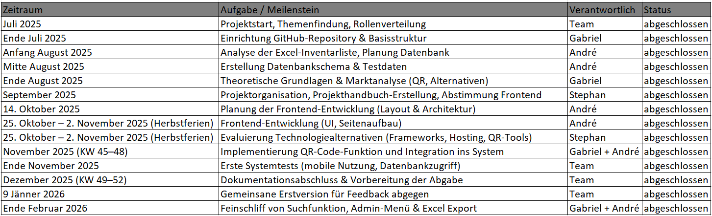
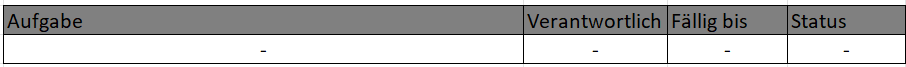
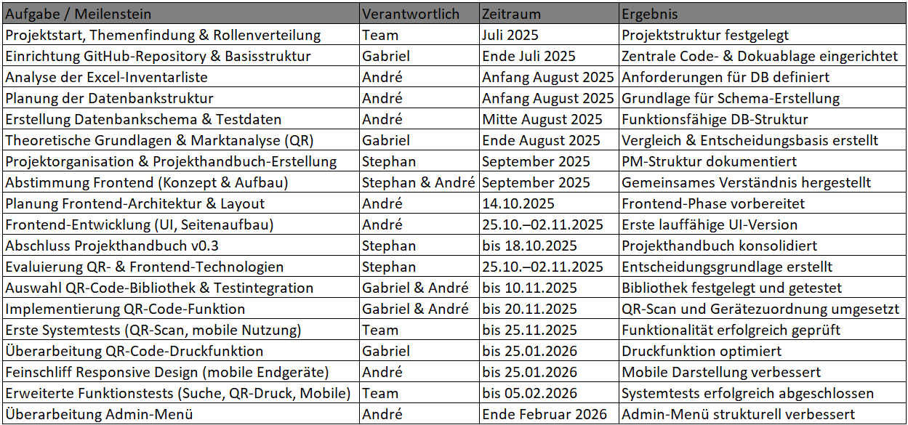

# Projekthandbuch – Diplomarbeit

## Entwicklung einer webbasierten Inventarisierung
**Stand:** 08. Februar 2026

### Projektübersicht
**Thema:** Entwicklung einer webbasierten Inventarisierungslösung mit QR-Codes zur Verwaltung schulischer IT-Ausstattung

**Team:**
- **Dietmair Stephan** – Projektmanagement & Organisation
- **Herbei Gabriel** – Analyse, Konzeption & Qualitätssicherung 
- **Karner André** – Softwareentwicklung & technische Umsetzung 

**Betreuer:** Dipl.-Wirt.-Ing. (FH) Leitner Christoph, BEd 
**Zeitraum:** Juni 2025 – März 2026
**Schule:** HTL Leoben

### Zielsetzung
Die Zielsetzung beschreibt das allgemeine Ziel und die Motivation hinter der Diplomarbeit. Dabei werden folgende Themen adressiert:

 **Aktueller Stand:**  
  An der Schule wird die IT-Ausstattung (PCs, Monitore, Beamer etc.) derzeit manuell in einer Excel-Liste verwaltet. Diese Methode ist zeitaufwendig, unübersichtlich und fehleranfällig.

 **Motivation:**  
  Der Wunsch besteht darin, den Inventarisierungsprozess zu digitalisieren und zu vereinfachen. Durch den Einsatz von QR-Codes soll die Verwaltung moderner, schneller und mobil zugänglich werden.

 **Was möchten wir erreichen?**  
  Entwicklung einer webbasierten Inventarisierungslösung mit QR-Code-Integration  
  Vereinfachung der Erfassung, Verwaltung und Nachverfolgung von Geräten  
  Zugriff über Smartphones/Tablets ohne manuelle Eingabe  
  Nutzung vorhandener Schulressourcen ohne Zusatzkosten  
  Stärkung digitaler Kompetenzen innerhalb der Schule  

 **Was möchten wir nicht erreichen (Nicht-Ziele)?**  
  Keine vollständige Integration in externe ERP- oder Ticketsysteme  
  Kein Austausch der bestehenden Schulserver-Struktur  
  Kein Fokus auf kaufmännische Warenwirtschaft  

 **Was ändert sich durch die Arbeit?**  
  Der manuelle Aufwand entfällt weitgehend  
  Geräte können schnell und mobil identifiziert werden  
  Die Verwaltung wird übersichtlicher und weniger fehleranfällig  
  Das Schulpersonal kann eigenständig Inventar anpassen oder erfassen  

### Projektorganisation
**Kommunikation:**  
 Microsoft Teams (Austausch, Statusupdates)    
 Whatsapp Gruppe (schneller Austausch)    
 GitHub (Code & Dokumentenverwaltung)  
 Persönliche Treffen nach Bedarf (sporadisch, bei Projektfortschritten oder Problemen)  

**Dateiablage:**  
GitHub-Repository: `DA-2526-Inventarisierung-von-QR-Codes`  

**Teammeetings:**  
 Treffen erfolgen nach Bedarf, meist bei Abschluss eines Projektabschnitts  
 Notizen und Entscheidungen werden im Projekthandbuch dokumentiert  

### Zeitplan (aktualisiert – bis Ende Februar 2026)

 

### Aktueller Projektstatus (Stand 08.02.2026)
- Datenbank- und Backend-Struktur fertiggestellt  
- Theoretische Grundlagen & Marktanalyse abgeschlossen  
- Projekthandbuch fertiggestellt und abgegeben  
- Frontend-Phase abgeschlossen, Admin-Menü überarbeitet  
- QR-Code-Druckfunktion überarbeitet  
- Responsive Design für mobile Endgeräte optimiert  
- Erweiterte Funktionstests (Suche, QR-Druck, Mobile) abgeschlossen  
- Dokumentation finalisiert und Abgabe vorbereitet 

## To-do-Liste (nächste Schritte)

 

Hinweis: Abgeschlossene Aufgaben werden in Kapitel 7 (Aufgabenhistorie) dokumentiert.

## Aufgabenhistorie

 

### Risiken & Herausforderungen
 Abhängigkeit von der Schul-IT-Infrastruktur (Serverrechte, Zugriff)  
 Zeitliche Belastung durch parallelen Schulunterricht  
 QR-Code-Leserkompatibilität auf unterschiedlichen Geräten  
 Fehlende Original-Listen für korrekte Inventarnummern  

### Dokumentenübersicht

 

### Zusammenfassung
Im Projektzeitraum von Juni 2025 bis Dezember 2025 wurden Analyse, Konzeption, technische Umsetzung sowie erste Tests erfolgreich durchgeführt. Das System ermöglicht eine schnelle Inventarisierung und Verwaltung von Geräten über mobile Endgeräte, reduziert den administrativen Aufwand und verbessert die Übersichtlichkeit der Inventardaten.
Der aktuelle Fokus liegt auf dem Abschluss der Dokumentation, dem Feinschliff einzelner Funktionen (Suche, Admin-Menü, QR-Druck) sowie auf finalen Tests zur Vorbereitung der Abgabe.

