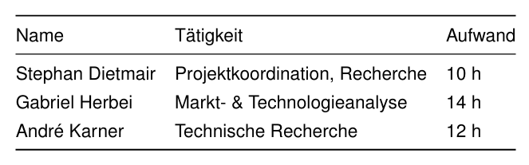
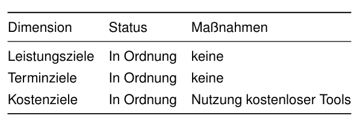
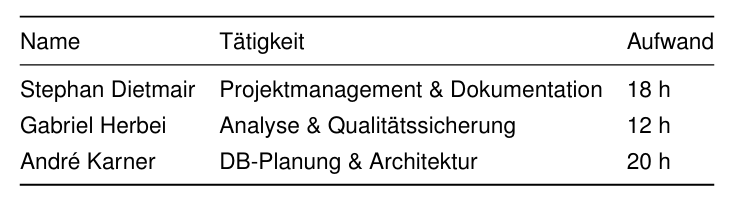
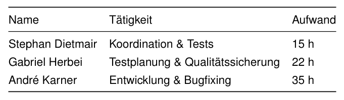
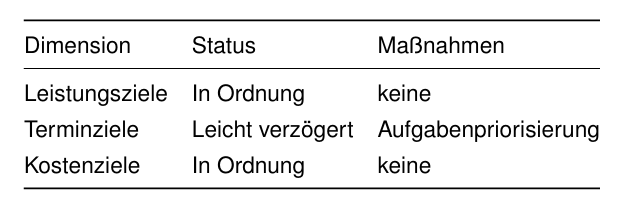
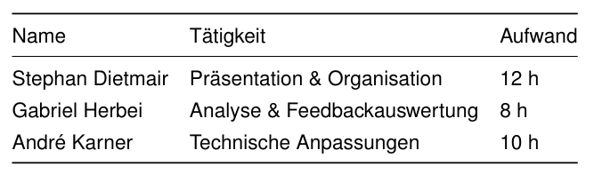
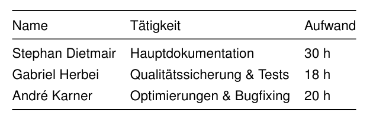
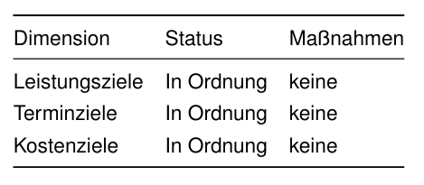

# Projektdokumentation  
## Diplomarbeit „Entwicklung einer webbasierten Inventarisierung“

**Projektteam:**  
- Stephan Dietmair – Projektmanagement & Organisation  
- Gabriel Herbei – Analyse & Qualitätssicherung  
- André Karner – Softwareentwicklung  

**Projektzeitraum:** Juni 2025 – März 2026  
**Schule:** HTL Leoben  

## Vorgehensmodell

Das Projekt wurde in Anlehnung an ein **agiles Vorgehensmodell** umgesetzt.  
Die Gesamtaufgabe wurde in **Projektphasen (Meilensteine)** unterteilt, innerhalb derer
konkrete Aufgaben (vergleichbar mit User Stories und Subtasks) definiert, bearbeitet und
abgeschlossen wurden.

Die Aufgabenverwaltung erfolgte über:

 - GitHub (Issues, Versionsverwaltung)
 - To-do-Listen im Projekthandbuch
 - Regelmäßige Abstimmungen im Team (Microsoft Teams, persönliche Treffen)

## Projektfortschritte nach Meilensteinen

## Projektfortschritt 1 – Recherchephase

### Berichtszeitraum
23.06.2025 – 21.07.2025

### Durchgeführte Arbeiten
- Projektstart und Themenfindung
- Analyse des bestehenden Inventarisierungsprozesses (Excel-Liste)
- Recherche zu QR-Code-Technologien und Alternativen
- Definition der groben Projektziele und Nicht-Ziele
- Erste Rollenverteilung im Team

### Aufwände der Teammitglieder

 

### Projektstatus

 

### Gesamtstatus
Die Recherchephase wurde erfolgreich abgeschlossen. Eine klare Zieldefinition sowie
eine geeignete technologische Basis konnten festgelegt werden.

### Teamarbeit
Die Zusammenarbeit verlief sehr gut. Aufgaben wurden klar verteilt und die Ergebnisse
transparent kommuniziert.

### Nächste Schritte & Entscheidungen
- Übergang in die Planungs- und Implementierungsphase
- Detailplanung der Systemarchitektur

## Projektfortschritt 2 – Implementierungs- & Planungsphase

### Berichtszeitraum
22.07.2025 – 06.10.2025

### Durchgeführte Arbeiten
- Erstellung des Projekthandbuchs
- Analyse der Excel-Inventarliste
- Planung der Datenbankstruktur
- Festlegung der Systemarchitektur
- Einrichtung des GitHub-Repositories

### Aufwände der Teammitglieder

 

### Projektstatus

| Dimension | Status | Maßnahmen |
|---------|--------|-----------|
| Leistungsziele | In Ordnung | keine |
| Terminziele | In Ordnung | keine |
| Kostenziele | In Ordnung | keine |

### Gesamtstatus
Die Planungsphase verlief planmäßig. Die technische Grundlage für die Implementierung
wurde vollständig definiert.

### Teamarbeit
Sehr strukturierte Zusammenarbeit, regelmäßige Abstimmungen und klare Aufgabenverteilung.

### Nächste Schritte & Entscheidungen
- Start der eigentlichen Implementierung
- Vorbereitung der Testphase

## Projektfortschritt 3 – Testphase

### Berichtszeitraum
07.10.2025 – 01.11.2025

### Durchgeführte Arbeiten
- Implementierung von Backend- und Datenbankfunktionen
- Entwicklung des Frontends
- Integration der QR-Code-Funktion
- Erste Systemtests (QR-Scan, mobile Nutzung)
- Fehlerbehebungen und Optimierungen

### Aufwände der Teammitglieder

 

### Projektstatus

 

### Gesamtstatus
Die Kernfunktionen wurden erfolgreich umgesetzt. Kleinere Verzögerungen konnten
durch Priorisierung kompensiert werden.

### Teamarbeit
Trotz der zusätzlichen Belastung durch den Schulbetrieb funktionierte die Zusammenarbeit im Team sehr gut.

### Nächste Schritte & Entscheidungen
- Vorbereitung der ersten Zwischenpräsentation
- Stabilisierung des Systems

## Projektfortschritt 4 – 1. Zwischenpräsentation

### Berichtszeitraum
02.11.2025 – 16.11.2025

### Durchgeführte Arbeiten
- Aufbereitung des Projektstandes
- Erstellung von Präsentationsunterlagen
- Feedbackeinholung von Betreuern
- Anpassungen basierend auf Rückmeldungen

### Aufwände der Teammitglieder

 

### Projektstatus
Alle Zielsetzungen der Zwischenpräsentation wurden erfüllt.

### Gesamtstatus
Das Projekt wurde positiv bewertet und befindet sich weiterhin im Plan.

### Nächste Schritte
- Übergang in die Dokumentationsphase

## Projektfortschritt 5 – Dokumentationsphase

### Berichtszeitraum
17.11.2025 – 26.02.2026

### Durchgeführte Arbeiten
- Erstellung und Überarbeitung der Projektdokumentation
- Finalisierung der technischen Dokumentation
- Erweiterte Funktionstests
- Feinschliff der Benutzeroberfläche

### Aufwände der Teammitglieder

 

### Projektstatus

 

### Gesamtstatus
Die Dokumentation befindet sich im Endstadium. Das System ist stabil und funktionsfähig.

### Nächste Schritte
- Abschlussarbeiten

